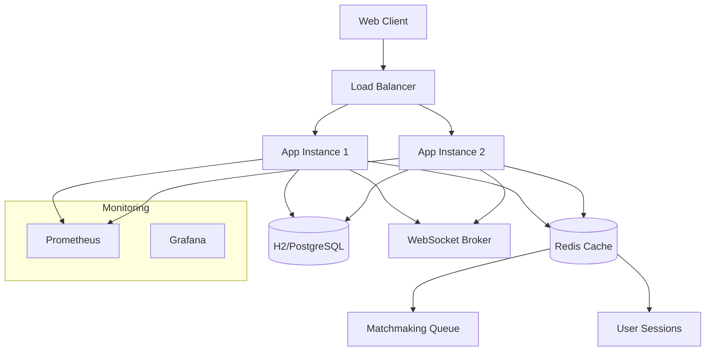

# 🎮 Game Matchmaking Service

A high-performance, real-time matchmaking service built with **Spring Boot 3.5.4** and **Java 21**. This service provides Elo-based skill matching, real-time WebSocket communication, JWT authentication, and comprehensive monitoring capabilities.

## 📋 Table of Contents

- [Features](#-features)
- [Tech Stack](#-tech-stack)
- [Quick Start](#-quick-start)
- [API Documentation](#-api-documentation)
- [WebSocket Integration](#-websocket-integration)
- [Authentication](#-authentication)
- [Docker Deployment](#-docker-deployment)
- [Configuration](#-configuration)
- [Monitoring](#-monitoring)
- [Development](#-development)
- [Contributing](#-contributing)

## ✨ Features

### Core Functionality
- 🎯 **Elo-based Matchmaking**: Intelligent skill-based player matching
- ⚡ **Real-time Communication**: WebSocket support for instant match notifications
- 🔐 **JWT Authentication**: Secure user authentication and authorization
- 📊 **Player Statistics**: Comprehensive Elo tracking and leaderboards
- 🚀 **High Performance**: Redis-backed queue system for scalability

### Advanced Features
- 🔄 **Auto-scaling Tolerance**: Dynamic Elo tolerance adjustment over time
- 📈 **Comprehensive Monitoring**: Prometheus metrics and health checks
- 🐳 **Docker Ready**: Complete containerization with Docker Compose
- 🌐 **CORS Support**: Cross-origin resource sharing enabled
- 🛡️ **Security**: Rate limiting, input validation, and secure headers

## 🛠️ Tech Stack

| Category | Technology |
|----------|------------|
| **Backend** | Spring Boot 3.5.4, Java 21 |
| **Database** | H2 (development), JPA/Hibernate |
| **Cache** | Redis 7.x |
| **Security** | Spring Security, JWT |
| **WebSocket** | STOMP over WebSocket |
| **Build** | Maven |
| **Containerization** | Docker, Docker Compose |
| **Monitoring** | Micrometer, Prometheus, Actuator |

## 🚀 Quick Start

### Prerequisites
- Java 21+
- Maven 3.6+
- Redis 6.0+ (or use Docker Compose)
- Docker & Docker Compose (optional)

### Local Development

1. **Clone the repository**
   ```bash
   git clone <repository-url>
   cd matchmaking-service
   ```

2. **Start Redis** (if not using Docker)
   ```bash
   redis-server
   ```

3. **Run the application**
   ```bash
   ./mvnw spring-boot:run
   ```

4. **Access the application**
   - Web Interface: http://localhost:8080
   - API Base URL: http://localhost:8080/api
   - Health Check: http://localhost:8080/actuator/health

### Docker Deployment

```bash
# Start all services (app + Redis)
docker-compose up -d

# View logs
docker-compose logs -f

# Stop services
docker-compose down
```

## 📚 API Documentation

### Base URL
```
http://localhost:8080/api
```

### Authentication Endpoints

#### Register User
```http
POST /api/auth/register
Content-Type: application/json

{
  "username": "player1",
  "email": "player1@example.com",
  "password": "password123"
}
```

**Response:**
```json
{
  "token": "eyJhbGciOiJIUzI1NiIsInR5cCI6IkpXVCJ9...",
  "username": "player1",
  "role": "USER",
  "expiresAt": "2024-01-01T12:00:00"
}
```

#### Login
```http
POST /api/auth/login
Content-Type: application/json

{
  "username": "player1",
  "password": "password123"
}
```

### Matchmaking Endpoints

#### Join Matchmaking Queue
```http
POST /api/match/join
Authorization: Bearer <token>
Content-Type: application/json

{
  "playerId": "player1",
  "elo": 1200
}
```

**Response:**
```json
{
  "success": true,
  "message": "Successfully joined matchmaking queue",
  "playerId": "player1",
  "elo": 1200
}
```

#### Leave Matchmaking Queue
```http
DELETE /api/match/leave/{playerId}
Authorization: Bearer <token>
```

#### Get Queue Status
```http
GET /api/match/status/{playerId}
Authorization: Bearer <token>
```

**Response:**
```json
{
  "success": true,
  "inQueue": true,
  "playerId": "player1",
  "elo": 1200,
  "queueTime": 15.5,
  "estimatedWait": 30.0
}
```

#### Get Leaderboard
```http
GET /api/match/leaderboard?limit=50
Authorization: Bearer <token>
```

**Response:**
```json
{
  "success": true,
  "leaders": [
    {
      "playerId": "player1",
      "elo": 1500,
      "wins": 10,
      "losses": 5,
      "rank": 1
    }
  ],
  "count": 50
}
```

#### Submit Match Result
```http
POST /api/match/result
Authorization: Bearer <token>
Content-Type: application/json

{
  "matchId": "match-123",
  "winnerId": "player1",
  "loserId": "player2",
  "winnerElo": 1220,
  "loserElo": 1180
}
```

### Monitoring Endpoints

#### System Metrics
```http
GET /api/monitoring/metrics
Authorization: Bearer <token>
```

#### Queue Metrics
```http
GET /api/monitoring/queue
Authorization: Bearer <token>
```

#### WebSocket Status
```http
GET /api/match/websocket/status
Authorization: Bearer <token>
```

### Control Endpoints

#### Pause Matchmaking
```http
POST /api/match/pause
Authorization: Bearer <token>
```

#### Resume Matchmaking
```http
POST /api/match/resume
Authorization: Bearer <token>
```

## 🔌 WebSocket Integration

### Connection
Connect to WebSocket endpoint with JWT authentication:

```javascript
const socket = new SockJS('http://localhost:8080/ws-match');
const stompClient = Stomp.over(socket);

const headers = {
    'Authorization': 'Bearer ' + token
};

stompClient.connect(headers, function(frame) {
    console.log('Connected: ' + frame);
    
    // Subscribe to match notifications
    stompClient.subscribe('/topic/matches', function(message) {
        const matchData = JSON.parse(message.body);
        console.log('Match found:', matchData);
    });
    
    // Subscribe to personal queue updates
    stompClient.subscribe('/user/queue/updates', function(message) {
        const update = JSON.parse(message.body);
        console.log('Queue update:', update);
    });
});
```

### Message Types

#### Match Found Notification
```json
{
  "type": "MATCH_FOUND",
  "matchId": "match-123",
  "players": [
    {
      "playerId": "player1",
      "elo": 1200
    },
    {
      "playerId": "player2",
      "elo": 1180
    }
  ],
  "timestamp": "2024-01-01T12:00:00Z"
}
```

#### Queue Position Update
```json
{
  "type": "QUEUE_UPDATE",
  "playerId": "player1",
  "position": 3,
  "estimatedWait": 45.0,
  "queueTime": 30.0
}
```

#### Match Result
```json
{
  "type": "MATCH_RESULT",
  "matchId": "match-123",
  "result": "WIN",
  "eloChange": +20,
  "newElo": 1220
}
```

## 🔐 Authentication

The service uses **JWT (JSON Web Tokens)** for authentication:

### Token Structure
- **Algorithm**: HS256
- **Expiration**: 24 hours (configurable)
- **Claims**: username, role, issued date

### Usage
Include the JWT token in the Authorization header:
```
Authorization: Bearer <your-jwt-token>
```

### Security Features
- Password encryption with BCrypt
- Token validation on all protected endpoints
- WebSocket authentication via token
- CORS protection
- Rate limiting (via Nginx in production)

## 🐳 Docker Deployment

### Development
```bash
# Start with basic setup
docker-compose up -d

# View logs
docker-compose logs -f app
```

### Production
```bash
# Start with Nginx reverse proxy
docker-compose --profile production up -d

# Scale the application
docker-compose up -d --scale app=3
```

### Environment Variables
```env
# Redis Configuration
SPRING_DATA_REDIS_HOST=redis
SPRING_DATA_REDIS_PORT=6379

# JWT Configuration
SECURITY_JWT_SECRET=your-super-secret-key
SECURITY_JWT_TTL_SECONDS=86400

# Database Configuration
SPRING_DATASOURCE_URL=jdbc:postgresql://db:5432/matchmaking
SPRING_DATASOURCE_USERNAME=matchmaking
SPRING_DATASOURCE_PASSWORD=password
```

## ⚙️ Configuration

### Application Properties

#### Matchmaking Settings
```properties
# Queue processing
match.max-wait-seconds=300
match.duration-seconds=600
match.poll-rate-ms=1000

# Elo tolerance
match.elo-tolerance=200
match.elo-tolerance-growth-per-second=10
match.elo-tolerance-max=800
```

#### Elo Rating System
```properties
# K-factor settings
elo.kfactor.default=32
elo.scale.factor=400.0
elo.kfactor.expert.threshold=2100
elo.kfactor.master.threshold=2400
```

#### WebSocket Configuration
```properties
app.ws.endpoint=/ws-match
app.ws.allowed-origins=*
```

## 📊 Monitoring

### Health Checks
- **Application**: `/actuator/health`
- **Matchmaking**: `/api/match/health`
- **Database**: Included in health endpoint
- **Redis**: Included in health endpoint

### Metrics (Prometheus)
- **Endpoint**: `/actuator/prometheus`
- **Custom Metrics**:
  - `matchmaking_queue_size`
  - `matchmaking_matches_created_total`
  - `matchmaking_processing_time_seconds`
  - `websocket_connections_active`

### Logging
```properties
# Logging levels
logging.level.org.games.matchmakingservice=INFO
logging.level.org.springframework.security=WARN
logging.level.org.springframework.web.socket=DEBUG
```

## 🔧 Development

### Running Tests
```bash
# Run all tests
./mvnw test

# Run specific test class
./mvnw test -Dtest=MatchmakingServiceTest

# Run with coverage
./mvnw test jacoco:report
```

### Code Quality
```bash
# Check code style
./mvnw checkstyle:check

# Run static analysis
./mvnw spotbugs:check

# Format code
./mvnw spring-javaformat:apply
```

### Database Management
```bash
# Access H2 Console (development)
http://localhost:8080/h2-console

# JDBC URL: jdbc:h2:mem:matchdb
# Username: sa
# Password: (empty)
```

### Redis Management
```bash
# Connect to Redis CLI
docker-compose exec redis redis-cli

# Monitor Redis commands
docker-compose exec redis redis-cli monitor

# View queue data
LRANGE matchmaking:queue 0 -1
```

## 🏗️ Architecture



## 🤝 Contributing

1. **Fork the repository**
2. **Create a feature branch**: `git checkout -b feature/amazing-feature`
3. **Commit changes**: `git commit -m 'Add amazing feature'`
4. **Push to branch**: `git push origin feature/amazing-feature`
5. **Open a Pull Request**

### Development Guidelines
- Follow Spring Boot best practices
- Write comprehensive tests
- Update documentation
- Ensure Docker compatibility
- Add appropriate logging

## 📄 License

This project is licensed under the MIT License - see the [LICENSE](LICENSE) file for details.

## 🙋‍♂️ Support

For support and questions:
- Create an issue on GitHub
- Check the [Wiki](wiki) for detailed guides
- Review the [API Documentation](#-api-documentation)

---

**Built with ❤️ using Spring Boot and Java 21**
